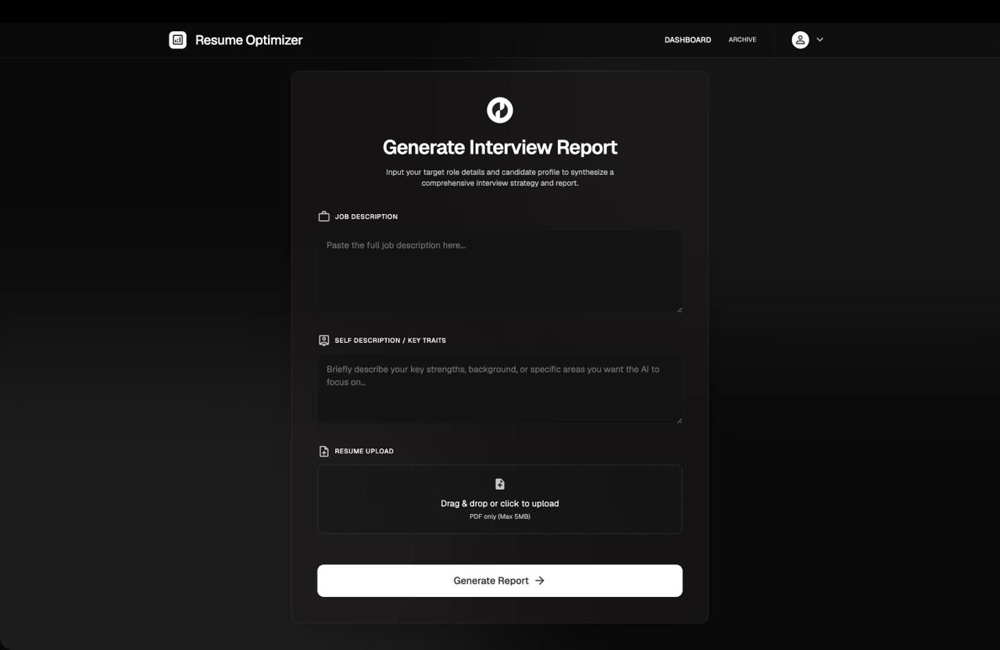
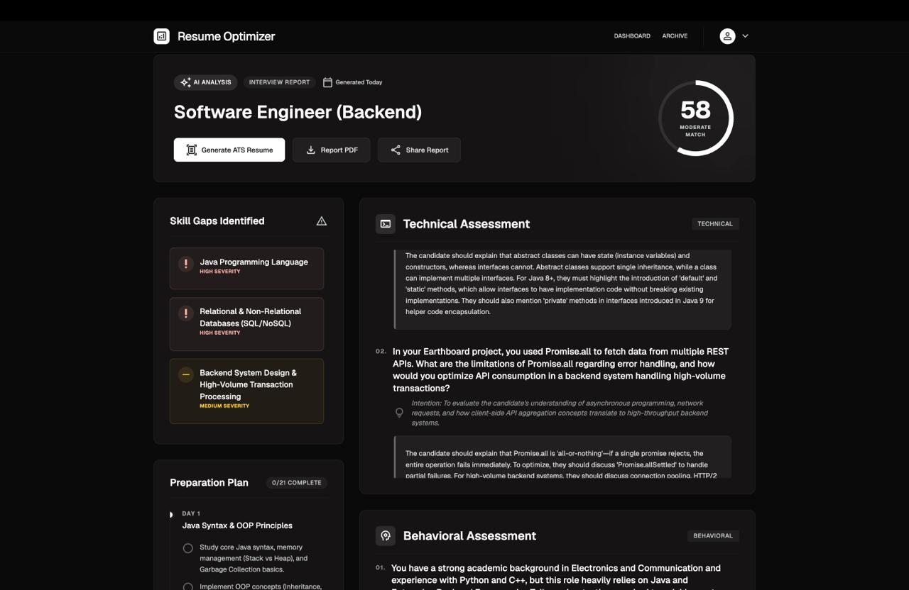
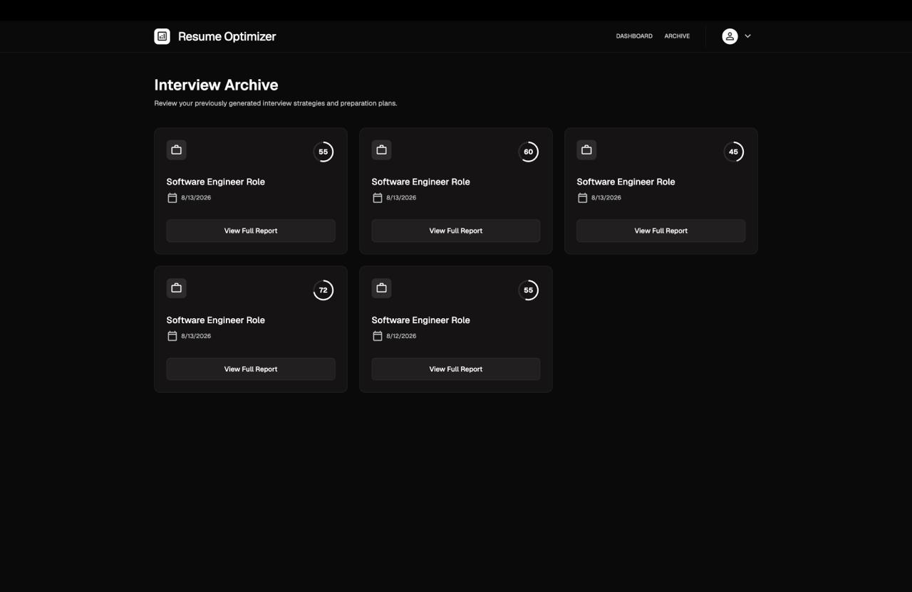
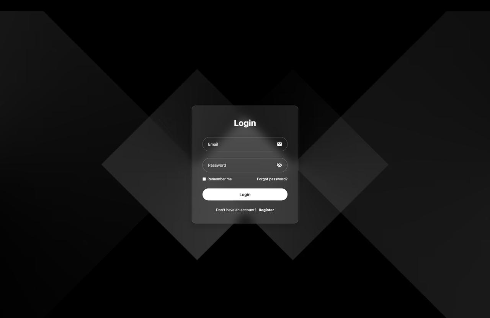
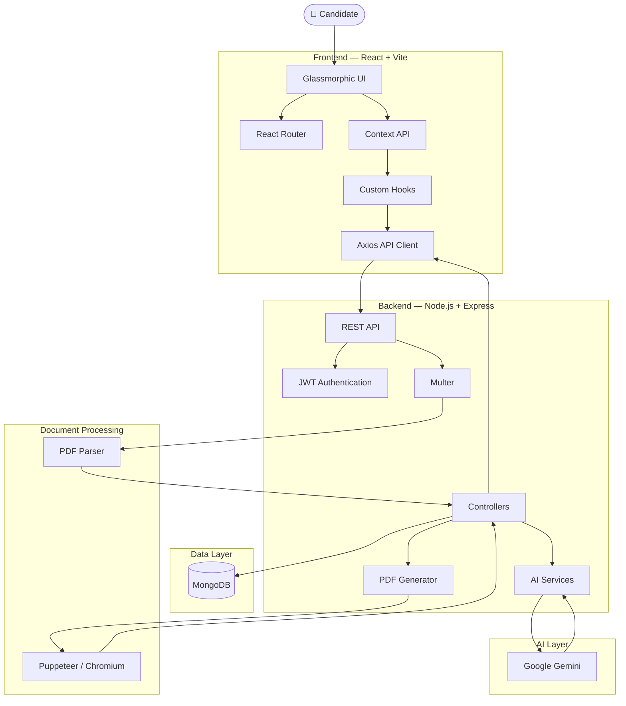
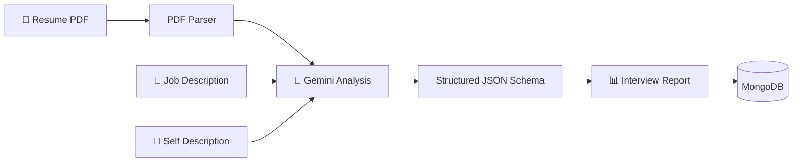
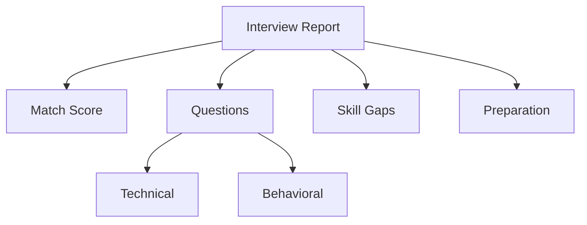
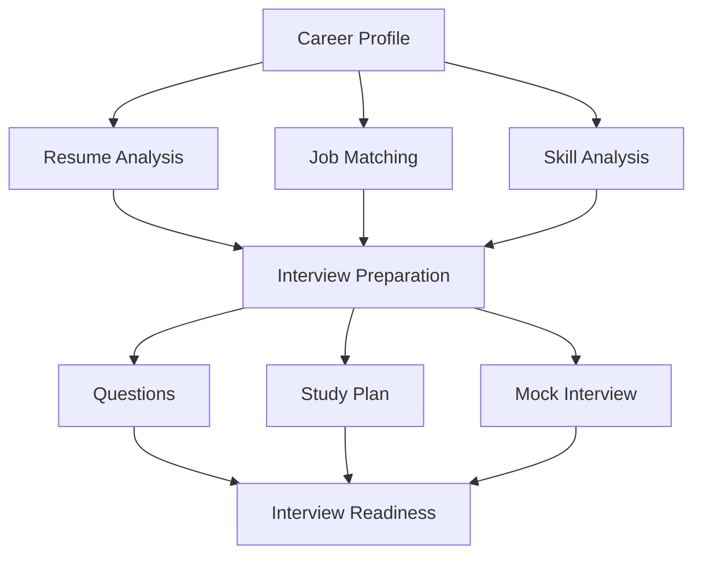

# 🚀 ATS Resume Optimizer & Interview Prep AI

> **AI-powered resume analysis, ATS optimization, and personalized interview preparation — built with the MERN stack and Google Gemini.**

ATS Resume Optimizer & Interview Prep AI is a full-stack application that helps candidates understand how well their resume matches a target job, identify skill gaps, prepare for interviews, and generate an ATS-friendly resume.

The platform combines **React, Node.js, Express, MongoDB, Google Gemini, PDF parsing, JWT authentication, and Puppeteer-based PDF generation** into a single end-to-end career preparation platform.

---

## ✨ Why This Project?

Most resume tools focus only on keyword matching.

This project goes further.

Instead of simply telling a candidate:

> "Your resume matches this job by 72%."

the system answers:

- 🎯 How well does my profile match this role?
- 🧠 What technical areas am I missing?
- 💻 What technical questions am I likely to face?
- 🤝 What behavioral questions should I prepare for?
- 📚 What should I study before the interview?
- 📄 How can I generate a cleaner ATS-friendly resume?
- 📊 How can I track my previous analyses?

The goal is to transform a **job description + resume** into an actionable interview preparation strategy.

---

# 📸 Application Preview

<div align="center">




</div>

<br />

<div align="center">




</div>

---

# 🧩 Core Features

## 🎯 AI-Powered Job Match Analysis

Upload a resume and provide a target job description.

The AI analyzes:

- Required technologies
- Candidate skills
- Relevant projects
- Experience
- Technical competencies
- Missing requirements
- Overall role compatibility

The result is represented as a **0–100 match score**.

---

## 🧠 Personalized Interview Report

Each analysis generates a structured interview preparation report containing:

### 📊 Match Score

A numerical estimate of how closely the candidate matches the target role.

### 🏷️ AI-Generated Job Title

The system infers the target role from the job description.

Examples:

```text
Junior Full Stack Developer (MERN)
Backend Engineer (Node.js)
Frontend Developer (React)
Machine Learning Engineer
````

### 💻 Technical Questions

The AI generates role-specific technical questions rather than generic interview questions.

Each question contains:

```text
Question
↓
Interviewer's Intention
↓
Recommended Answer Guidance
```

### 🤝 Behavioral Questions

Questions focused on:

* Teamwork
* Communication
* Conflict resolution
* Ownership
* Handling failure
* Receiving feedback
* Working under deadlines
* Learning unfamiliar technologies

### 🚨 Skill Gap Analysis

The system identifies missing or weak skills and categorizes their severity:

```text
HIGH
MEDIUM
LOW
```

### 📚 7-Day Preparation Plan

A personalized day-by-day preparation roadmap based on:

* Job requirements
* Candidate weaknesses
* Technical skill gaps
* Interview relevance

Example:

```text
Day 1 → React State Management
Day 2 → Node.js & Express
Day 3 → MongoDB
Day 4 → Authentication & Security
Day 5 → System Design
Day 6 → Behavioral Preparation
Day 7 → Mock Interview & Revision
```

---

# 📄 ATS Resume Optimization

The platform can dynamically generate an ATS-friendly resume using the candidate's information and target job requirements.

The backend uses **Puppeteer** to render the resume into a controlled HTML/CSS layout and generate a PDF.

### Pipeline

```text
Resume Data
     ↓
Resume Template
     ↓
HTML + CSS
     ↓
Puppeteer
     ↓
Headless Chromium
     ↓
PDF Buffer
     ↓
Downloadable Resume
```

This provides consistent PDF rendering without relying on client-side browser printing.

---

# 🔐 Authentication & Security

The application uses:

* JWT authentication
* HTTP-only cookies
* Password hashing with bcrypt
* Protected API routes
* User-specific report access
* Token blacklist for logout
* CORS configuration
* Environment-based secrets

Authentication flow:

```text
User
 ↓
Login / Register
 ↓
Password Verification
 ↓
JWT Generation
 ↓
HTTP-only Cookie
 ↓
Protected API Request
 ↓
Authentication Middleware
 ↓
req.user
```

---

# 🏗️ System Architecture



---

# 🔄 AI Interview Report Pipeline

The core AI pipeline works as follows:



The AI receives three primary inputs:

```text
Resume
Job Description
Self Description
```

and produces:



---

# 🧠 Structured AI Output

Instead of relying on unstructured AI text, the Gemini integration uses a structured response schema.

The generated report follows:

```json
{
  "title": "Full Stack Developer (MERN)",
  "matchScore": 82,
  "technicalQuestions": [
    {
      "question": "...",
      "intention": "...",
      "answer": "..."
    }
  ],
  "behavioralQuestions": [
    {
      "question": "...",
      "intention": "...",
      "answer": "..."
    }
  ],
  "skillGaps": [
    {
      "skill": "AWS",
      "severity": "high"
    }
  ],
  "preparationPlan": [
    {
      "day": 1,
      "focus": "React State Management",
      "tasks": [
        "Review Redux Toolkit",
        "Build a small Redux application"
      ]
    }
  ]
}
```

This makes the AI output predictable and easy to consume on the frontend.

---

# 🛠️ Tech Stack

## Frontend

| Technology       | Purpose                   |
| ---------------- | ------------------------- |
| React            | UI development            |
| Vite             | Development/build tooling |
| Tailwind CSS     | Styling                   |
| React Router DOM | Client-side routing       |
| Axios            | API communication         |
| Context API      | Global application state  |

---

## Backend

| Technology    | Purpose                |
| ------------- | ---------------------- |
| Node.js       | Runtime                |
| Express.js    | REST API               |
| MongoDB       | Database               |
| Mongoose      | ODM                    |
| JWT           | Authentication         |
| bcrypt        | Password hashing       |
| Cookie Parser | Cookie handling        |
| CORS          | Cross-origin requests  |
| Multer        | File uploads           |
| PDF Parse     | Resume text extraction |

---

## AI & Document Processing

| Technology             | Purpose                         |
| ---------------------- | ------------------------------- |
| Google Gemini          | AI analysis & report generation |
| Google GenAI SDK       | Gemini API integration          |
| Puppeteer              | Headless browser PDF generation |
| Structured JSON Schema | Reliable AI output              |

---

# 📁 Project Structure

```text
ats-resume-optimizer/
│
├── Frontend/
│   ├── src/
│   │   ├── components/
│   │   ├── pages/
│   │   ├── hooks/
│   │   ├── context/
│   │   ├── services/
│   │   ├── assets/
│   │   └── App.jsx
│   │
│   ├── public/
│   └── package.json
│
├── Backend/
│   ├── src/
│   │   ├── config/
│   │   ├── controllers/
│   │   ├── middleware/
│   │   ├── models/
│   │   ├── routes/
│   │   ├── services/
│   │   └── app.js
│   │
│   ├── server.js
│   └── package.json
│
├── docs/
│   ├── dashboard.jpeg
│   ├── report.jpeg
│   ├── archive.jpeg
│   └── login.jpeg
│
└── README.md
```

---

# 🔌 API Overview

## Authentication

### Register

```http
POST /api/auth/register
```

### Login

```http
POST /api/auth/login
```

### Logout

```http
POST /api/auth/logout
```

### Get Current User

```http
GET /api/auth/me
```

---

## Interview Reports

### Generate Report

```http
POST /api/interview/
```

Multipart form data:

```text
resume
jobDescription
selfDescription
```

Response:

```json
{
  "message": "Interview report generated successfully.",
  "interviewReport": {
    "title": "...",
    "matchScore": 82,
    "technicalQuestions": [],
    "behavioralQuestions": [],
    "skillGaps": [],
    "preparationPlan": []
  }
}
```

---

### Get Report by ID

```http
GET /api/interview/report/:interviewId
```

---

### Get All Reports

```http
GET /api/interview/
```

---

# ⚙️ Local Development

## 1. Clone the Repository

```bash
git clone https://github.com/yourusername/ats-resume-optimizer.git

cd ats-resume-optimizer
```

---

## 2. Configure Environment Variables

Create:

```text
Backend/.env
```

Add:

```env
PORT=3000

MONGO_URI=your_mongodb_connection_string

JWT_SECRET=your_super_secret_jwt_key

GOOGLE_GEMINI_API_KEY=your_gemini_api_key
```

> Never commit `.env` files or API keys to Git.

---

# 📦 Install Dependencies

## Backend

```bash
cd Backend

npm install
```

## Frontend

Open another terminal:

```bash
cd Frontend

npm install
```

---

# ▶️ Run the Application

## Start Backend

```bash
cd Backend

npm start
```

Backend:

```text
http://localhost:3000
```

---

## Start Frontend

```bash
cd Frontend

npm run dev
```

Frontend:

```text
http://localhost:5173
```

---

# 🔒 Environment & Security Notes

Before deploying this application:

* Store secrets using environment variables.
* Never expose the Gemini API key to the frontend.
* Use secure cookies in production.
* Configure production CORS origins.
* Use HTTPS.
* Add request validation and rate limiting.
* Restrict uploaded file types and sizes.
* Sanitize user-provided content before rendering HTML.
* Configure Puppeteer securely in production.

---

# 🎨 UI Design

The application uses a dark **glassmorphic interface** designed around an AI/analytics dashboard aesthetic.

Design characteristics include:

* Dark surface hierarchy
* Glassmorphism
* Backdrop blur
* Minimal borders
* Accent-based status indicators
* Circular match-score visualization
* Scrollable report sections
* Responsive layouts
* Card-based information architecture

The report page is designed to let users scan:

```text
Overall Match
      ↓
Skill Gaps
      ↓
Technical Questions
      ↓
Behavioral Questions
      ↓
Preparation Plan
```

without overwhelming the user with a single long page.

---

# 🧪 Example AI Workflow

Suppose the candidate provides:

### Job Description

```text
Looking for a Full Stack Developer with experience in
React, Node.js, Express, MongoDB, Redux and AWS.
```

### Candidate Resume

```text
React
Node.js
Express
MongoDB
Multiple MERN projects
No AWS experience
```

The system may determine:

```text
Match Score: 78/100
```

and identify:

```text
HIGH
AWS / Cloud Deployment

MEDIUM
Advanced State Management
```

Then generate questions such as:

```text
How would you design authentication in a MERN application?

How would you optimize a slow MongoDB query?

What is the difference between Redux and React Context?

How would you deploy a Node.js application to AWS?
```

The preparation plan is then generated around the identified gaps.

---

# 📈 Engineering Highlights

This project demonstrates practical implementation of:

### Full-Stack Development

```text
React
   ↓
REST APIs
   ↓
Express
   ↓
MongoDB
```

### AI Integration

```text
User Data
   ↓
Prompt Engineering
   ↓
Gemini
   ↓
Structured JSON
   ↓
MongoDB
```

### Authentication

```text
Credentials
   ↓
bcrypt
   ↓
JWT
   ↓
HTTP-only Cookie
   ↓
Protected Routes
```

### Document Processing

```text
PDF Upload
   ↓
Multer
   ↓
PDF Parsing
   ↓
Resume Text
   ↓
AI Analysis
```

### PDF Generation

```text
Resume Data
   ↓
HTML/CSS
   ↓
Puppeteer
   ↓
Chromium
   ↓
PDF
```

---

# 🚧 Roadmap

The project can be extended with:

* [ ] Resume keyword optimization
* [ ] ATS keyword scoring
* [ ] Resume section recommendations
* [ ] Multiple resume templates
* [ ] Job-specific resume rewriting
* [ ] AI mock interview mode
* [ ] Voice-based interview practice
* [ ] Interview answer evaluation
* [ ] Interview history analytics
* [ ] Resume version comparison
* [ ] Job application tracking
* [ ] LinkedIn profile analysis
* [ ] Rate limiting
* [ ] Production deployment
* [ ] Automated testing
* [ ] CI/CD pipeline

---

# 🧭 Future Vision

The long-term goal is to turn the project into an **AI career preparation platform** rather than simply an ATS checker.



---

# ⭐ Why This Project Stands Out

This project is not just a CRUD MERN application.

It combines:

* Full-stack architecture
* Structured AI outputs
* Authentication
* File processing
* PDF parsing
* Dynamic PDF generation
* Database persistence
* REST API design
* State management
* Responsive UI
* AI-driven personalization

It demonstrates how modern AI capabilities can be integrated into a conventional full-stack application to solve a practical problem.

---

# 🤝 Contributing

Contributions are welcome.

### Fork the repository

```bash
git fork https://github.com/yourusername/ats-resume-optimizer
```

### Create a feature branch

```bash
git checkout -b feature/your-feature
```

### Commit changes

```bash
git commit -m "feat: add your feature"
```

### Push the branch

```bash
git push origin feature/your-feature
```

Then open a Pull Request.

---

# 📄 License

This project is currently available for educational and portfolio purposes.

Add an appropriate open-source license before accepting external contributions.

---

# 👨‍💻 Author

**Rudra Pratap Singh**

Full-Stack Developer | AI/ML Enthusiast

---

<div align="center">

### ⭐ If you found this project interesting, consider giving it a star!

**Built with React · Node.js · MongoDB · Google Gemini · Puppeteer**

</div>
